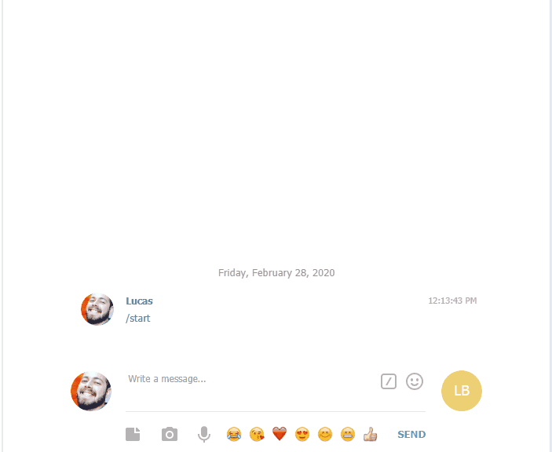

<h4 align="center">
  This is a bot for telegran writen in Java
</h4>
<p align="center">
  

  

  
  
  

  

</p>

<p align="center">
  <a href="#rocket-technologies">Technologies</a>&nbsp;&nbsp;&nbsp;|&nbsp;&nbsp;&nbsp;
  <a href="#information_source-how-to-use">How To Use</a>&nbsp;&nbsp;&nbsp;|&nbsp;&nbsp;&nbsp;
</p>

<p align="center">
  
</p>


## :rocket: Technologies

This project was developed just for study with the technologies:

-  [TelegranBot](https://core.telegram.org/botsg/)
-  [Java](https://www.java.com/pt_BR/)
-  [IntelliJ IDE](https://www.jetbrains.com/idea/)

## :information_source: How To Use

To clone and run this application, you'll need [Git](https://git-scm.com), Java SDK

```bash
# Clone this repository
$ git clone https://github.com/lucmkz/bottelegran

```


---

Made by Lucas Santos :wave: [Get in touch!](https://www.linkedin.com/in/lucasmk/)
